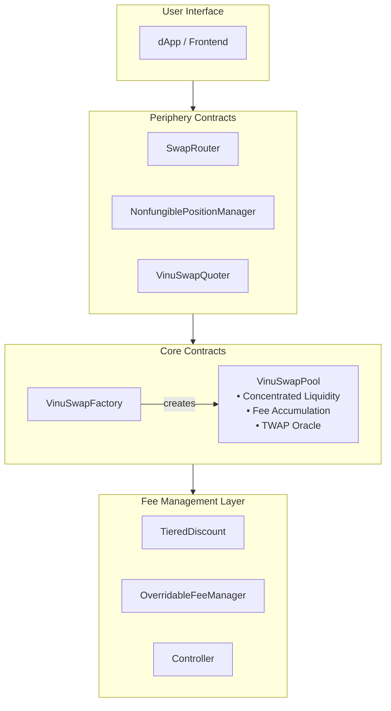

# VinuSwap Protocol

VinuSwap is a decentralized exchange (DEX) protocol built on VinuChain, based on the Uniswap V3 architecture with custom enhancements for the VinuChain ecosystem.

## What is VinuSwap?

VinuSwap implements **concentrated liquidity**, allowing liquidity providers to allocate capital within custom price ranges. This capital efficiency improvement enables:

- **Up to 4000x capital efficiency** compared to constant product AMMs
- **Customizable fee tiers** for different pair volatilities
- **NFT-based liquidity positions** with optional locking
- **Dynamic fee discounts** based on token holdings

## Key Features

### Concentrated Liquidity
Liquidity providers can concentrate their capital within specific price ranges, earning fees only when the market trades within their selected range.

### Position Locking
VinuSwap extends the standard position manager with **position locking** - allowing liquidity providers to lock their positions until a specified timestamp.

### Dynamic Fee Management
The protocol supports pluggable fee managers that can:
- Provide tiered discounts based on token holdings
- Override fees on a per-pool basis
- Implement custom fee logic

### Multi-Account Fee Distribution
Protocol fees can be distributed to multiple accounts with configurable shares through the Controller contract.

## Architecture Overview

## Getting Started

<table>
  <tr>
    <td>
      <strong>New to VinuSwap?</strong> 
      Start with the <a href="overview/concepts.md">Core Concepts</a> to understand concentrated liquidity and the protocol architecture.
    </td>
  </tr>
  <tr>
    <td>
      <strong>Ready to Integrate?</strong> 
      Follow the <a href="guides/local-environment.md">Local Environment Setup</a> guide to start building.
    </td>
  </tr>
  <tr>
    <td>
      <strong>Looking for Contract Details?</strong> 
      Check the <a href="reference/core/overview.md">Contract Reference</a> for complete API documentation.
    </td>
  </tr>
</table>

## Quick Links

| Resource | Description |
|----------|-------------|
| [Core Concepts](overview/concepts.md) | Understand concentrated liquidity and protocol mechanics |
| [Swap Guide](guides/swapping.md) | Implement token swaps in your application |
| [Liquidity Guide](guides/providing-liquidity.md) | Add and manage liquidity positions |
| [SDK Reference](sdk/overview.md) | TypeScript SDK for VinuSwap integration |
| [Contract Reference](reference/core/overview.md) | Complete smart contract API documentation |
| [Deployment Guide](deployment/overview.md) | Deploy VinuSwap to VinuChain |

## Contract Addresses

### VinuChain Mainnet

| Contract | Address |
|----------|---------|
| VinuSwapFactory | `0xd74dEe1C78D5C58FbdDe619b707fcFbAE50c3EEe` |
| SwapRouter | `0x48f450475a8b501A7480C1Fd02935a7327F713Ad` |
| NonfungiblePositionManager | `0xF699ec0764741f66F81068665eFFAeefA3c6037a` |
| VinuSwapQuoter | `0xEed635Fa2343355d9bA726C379F2B5dEa70fE65C` |
| NonfungibleTokenPositionDescriptor | `0xCA04dFDEE5778f6c23a7BdBa46A8D95F5094e4B5` |
| Controller | `0x47fF80713b1d66DdA47237AB374F3080E2075528` |

## Security

VinuSwap inherits the battle-tested security of Uniswap V3 with additional security measures:

- **Reentrancy Protection** - All state-changing functions protected
- **Delegatecall Prevention** - Core contracts cannot be used as implementation targets
- **Callback Validation** - Ensures callbacks originate from legitimate pools
- **Position Locking** - Prevents unauthorized liquidity removal

For security-related inquiries, please refer to the [Security Companion Document](../Security%20Companion%20Document.pdf).

## License

- Core contracts: BUSL-1.1
- Periphery contracts: GPL-2.0-or-later
- Custom extensions: MIT
